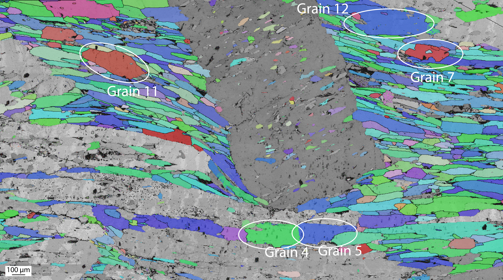

# Merrypopins

  

**merrypopins** is a Python library to streamline the workflow of nano‑indentation experiment data processing, automated pop-in detection and analysis. It provides five core modules:

- **`load_datasets`**: Load and parse `.txt` measurement files and `.tdm`/`.tdx` metadata files into structured pandas DataFrames. Automatically detects headers, timestamps, and measurement channels.
- **`preprocess`**: Clean and normalize indentation data with filtering, baseline correction, and contact point detection.
- **`locate`**: Identify and extract pop‑in events within indentation curves using advanced detection algorithms, including:
  - Isolation Forest anomaly detection
  - CNN Autoencoder reconstruction error
  - Fourier-based derivative outlier detection
  - Savitzky-Golay smoothed gradient thresholds
- **`statistics`**: Perform statistical analysis and model fitting on located pop‑in events (e.g., frequency, magnitude, distribution). The statistics module allows you to compute detailed pop-in statistics, such as:
  - Pop-in statistics (e.g., load-depth and stress-strain metrics)
  - Stress-strain transformation using Dao et al. (2008)
  - Curve-level summary statistics (e.g., total pop-in duration, average time between pop-ins)
  - Pop-in shape statistics like depth jump, average velocity, and curvature
- **`make_dataset`**: Construct enriched datasets by running the full merrypopins pipeline and exporting annotated results and visualizations.

---

## 🛠 Source Instrumentation
Merrypopins was developed using datasets generated by the Bruker Hysitron TI 990 TriboIndenter — a high-precision nanoindentation platform. The library natively supports .txt and .tdm/.tdx file formats exported by the Hysitron software suite.

  

Typical indentation experiments conducted with the TI 990 include:

- Force-depth curve acquisition at nano/micro scale
- High-resolution pop-in event detection
- Automated test grid data export

The preprocessing and pop-in detection tools in Merrypopins are tuned to handle the structural patterns and noise profiles specific to these datasets.

### Example: Nanoindentation Grain Selection and Deformation

Below are example visualizations from Electron Backscatter Diffraction (EBSD) maps used to select grain areas, followed by indentation marks after testing:

#### ➤ Pre-indentation EBSD with Labeled Grains

  

#### ➤ Post-indentation Microstructure with Deformation (Area on Grain 5)

  

These images highlight the complex deformation behavior analyzed by the `merrypopins` toolset for robust pop-in detection.

---

For a quick overview, see the [Quickstart](quickstart.md).

Merrypopins is developed by [Cahit Acar](mailto:c.acar.business@gmail.com), [Anna Marcelissen](mailto:anna.marcelissen@live.nl), [Hugo van Schrojenstein Lantman](mailto:h.w.vanschrojensteinlantman@uu.nl), and [John M. Aiken](mailto:johnm.aiken@gmail.com).
